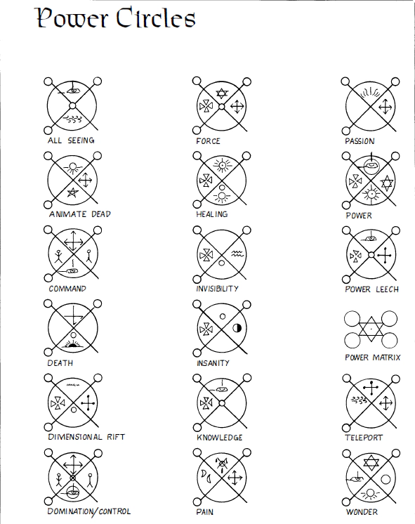

# 力量法阵表

## 全视-力量法阵

就像水晶球一样，这个法阵会定位并形成所寻找之人的清晰视觉影像。

召唤师有三种方法可以通过魔法定位和观察他人。

1. 召唤者可以将人物的 "真名 "刻在知识符号附近，或者
2. 将被寻找者的某些实物 "方面"，如他/她的一绺头发、指甲剪、皮肤、血液（干的或新鲜的；可以是抹布或绷带上的）、身体部位（手指、耳朵、脚趾等），也放在知识符号附近。
3. 用被寻找者的朋友或亲戚血祭。

当一切准备就绪，法阵能量充足时，召唤师点燃一支蜡烛，将其置于全视之眼的瞳孔中。烟雾异常浓郁，并在蜡烛上方形成了烟雾朦胧的效果（需要一个近战回合）。

片刻之后，朦胧中出现了被寻找者的影像。法阵中的观察者可以清楚地听到和看到目标所说的一切或遇到的一切。其视角类似于摄像机的直视侧视；它不能平移或调整角度以查看房间/区域的其他部分或摄像机外的人、物体或区域。

只要法阵使用者愿意，无论目标人物走到哪里，魔法影像都会一直跟随，直到蜡烛燃尽为止（长时间燃烧的蜡烛可以持续六小时，普通蜡烛大约可以持续 1-2小时）。点燃新的蜡烛可在一个近战回合内恢复影像。

熄灭蜡烛可以在不关闭法阵的情况下关闭声音和图像。重新点燃蜡烛并将其置于全视之眼中就能恢复图像。

移除被观察者的姓名、特征或被杀亲友的遗骸会导致影像消失，除非将它们放回法阵并投入100点 P.P.E.点数重新激活，否则影像无法恢复。

同样，一旦消除了前一个目标的影响，就可以举行一个10分钟的简短仪式，输入100 点 P.P.E.，并放置新的组件或真名，以便观察新的目标。与往常一样，法阵本身保持完好并可使用，直到其图像的 50% 以上被移除。

#### 法阵说明

1. 如果法阵没有被封印，或者法阵的设计允许选定的其他人进入，那么这些其他人就可以看到召唤师变出的任何图像，如果他们知道如何使用，甚至可以自己使用法阵。
2. 法阵可以定位、显示和追踪观察目标，即使他是隐形的（以半透明的形象出现，就像玻璃做的）和星体形态。
3. 法阵还可以跟随目标人物进入星界，但不能进入其他维度，也不能在时间上向前或向后移动。法阵可以在同一维度的任何地方定位任何人（星界是唯一的例外）。
4. 所有事件和图像都是 "实时 "的，即在发生时看到。
5. 虽然被观察者的言语和背景中的标志可能会显示位置，观察者可能认识的地标也会显示位置，但不会显示距离或精确位置。
6. 被观察的目标只有身处异次元空间，或身处反魔法云、圣堂、避难所、魔法防护圈（上位）或奇妙法阵或力量蛭石中，才能逃脱法阵的发现。当然，移除 "方面 "链接组件也会阻止法师追踪该角色，前提是他不能使用其他组件。

#### 范围

无限

#### 持续时间

只要蜡烛还在燃烧，所有组件还在原位，它就处于活跃状态。蜡烛燃烧殆尽或熄灭后即进入休眠状态

#### 豁免

无

#### 组件

法阵必须用曼德拉草根的汁液绘制，符号用鹰血绘制。在全视之眼符号的中心点燃一根蜡烛（通常是3小时或6小时的蜡烛）。法阵的初始激活需要将龙骨（1/2 盎司龙粉）洒进蜡烛的火焰中。

#### 真言

Lictalon yin Lictalon-acba

#### P.P.E.

400P.P.E.创建法阵

100P.P.E.观察不同的人（前提是组件可用）或在组件被移除后恢复观察。

## 复活（并控制）死亡-力量法阵

#### 范围

#### 持续时间

#### 豁免

#### 组件

#### 真言

#### P.P.E.

## 命令-力量法阵

#### 范围

#### 持续时间

#### 豁免

#### 组件

#### 真言

#### P.P.E.

## 死亡-力量法阵

#### 范围

#### 持续时间

#### 豁免

#### 组件

#### 真言

#### P.P.E.

## 维度裂缝-力量法阵

#### 范围

#### 持续时间

#### 豁免

#### 组件

#### 真言

#### P.P.E.

## 控制-力量法阵

#### 范围

#### 持续时间

#### 豁免

#### 组件

#### 真言

#### P.P.E.

## 力场-力量法阵

这个法阵会形成一个坚不可摧的力量包围圈，覆盖法阵的整个半径（或力量矩阵中的所有法阵）。

这种力量可以承受无限量的伤害，并阻止恶臭、蒸汽、迷雾、云层、召唤闪电、火球、元素、幽灵、实体、星际旅行者和类似的力量穿透它并进入法阵。

不过，幻术攻击、符咒、迷魂术和幻象是攻击力场内的人的有效手段。

驱散魔法屏障会暂时否定力场法阵，但该法阵对该法术的豁免+3，并会在 1D4 次近战内重新出现。

调用真言和额外的 100 点 P.P.E.可以随时重新激活法阵。如果力量法阵之前已在整个持续时间内被激活，则在一小时间隔内无法重新激活。

#### 范围

#### 持续时间

#### 豁免

#### 组件

#### 真言

#### P.P.E.

## 治疗-力量法阵

#### 范围

#### 持续时间

#### 豁免

#### 组件

#### 真言

#### P.P.E.

## 隐身-力量法阵

#### 范围

#### 持续时间

#### 豁免

#### 组件

#### 真言

#### P.P.E.

## 疯狂-力量法阵

#### 范围

#### 持续时间

#### 豁免

#### 组件

#### 真言

#### P.P.E.

## 知识-力量法阵

#### 范围

#### 持续时间

#### 豁免

#### 组件

#### 真言

#### P.P.E.

## 痛苦-力量法阵

#### 范围

#### 持续时间

#### 豁免

#### 组件

#### 真言

#### P.P.E.

## 激情-力量法阵

#### 范围

#### 持续时间

#### 豁免

#### 组件

#### 真言

#### P.P.E.

## 力量-力量法阵

#### 范围

#### 持续时间

#### 豁免

#### 组件

#### 真言

#### P.P.E.

## 能量汲取-力量法阵

#### 范围

#### 持续时间

#### 豁免

#### 组件

#### 真言

#### P.P.E.

## 力量矩阵-力量法阵

#### 范围

#### 持续时间

#### 豁免

#### 组件

#### 真言

## 奇迹-力量法阵

#### 范围

#### 持续时间

#### 豁免

#### 组件

#### 真言

#### P.P.E.

#### P.P.E.