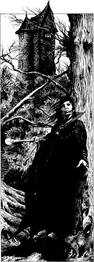

# 灵能职业：灵能秘术师Psi-Mystic

灵能秘术师是一种角色，他们通过直觉能力可以在心灵、魔法和玄学的层面上感知事物。他们常常是受人尊敬的顾问和预言家，能够洞见未来。

灵能秘术师力量的直觉本质在于，他们会突然知道一些事情，并学会信任自己的感觉。

这也意味着，大多数灵能秘术师不接受正规教育，而是追随自己的宇宙之路。

大多数人认为，过多的教育会造成隔阂，使人无法接触到自然的心灵感应，也无法接触到周围真实的世界。

他们还认为，过于依赖技术和实物也会产生同样的效果。因此，灵能秘术师会避免去科技发达的地方（城市）、新鲜玩意和收集大量有形物品，除了那些能振奋精神的物品，如艺术品、乐器、书籍和类似物品。

拥有一定程度灵能的人可以接受灵能秘术师或僧侣的教导，学习神秘主义、哲学、冥想以及向世界打开 "心眼 "和身体的方法。

然而，大多数灵能力者会告诉你，一个人并不是通过学习成为秘术师的，而是与生俱来的 "天赋"。

## 灵能秘术师的能力

灵能秘术师的能力是灵能和魔力的结合。

### 灵能力量

灵能秘术师在一级时自动拥有驱魔、感知邪恶、第六感、冥想和心灵阻断的能力，此外，他还可以从感应系中选择三种能力，从物理或治疗系中选择两种能力。

#### 附加灵能

角色在 3、5、7、9、11、13 和 15 级时可以从感知或物理系中选择一种额外的灵能。

### 心能点I.S.P.

确定角色的心能点时，以 M.E.数为基数，掷 2D4x10 并将其加到基数上。

从一级开始，每增加一级，角色就会再获得 10 点 I.S.P.。被视为主要灵能。

### 魔法力量

灵能秘术师多年来一直在思考生命的奥秘、自己在生命中的位置，以及魔法如何能帮助他找到自己在世界上的位置。

当他准备以冒险家的身份探索世界，找到或创造自己在世界上的位置时，就会进入持续六天的冥想恍惚状态。冥想结束后，角色会凭直觉知道如何施放六个特定的法术。这些法术的性质通常会反映出角色的阵营和当前的人生观。

在第一级时，从第一和第二级魔法中总共选择6个法术。这些法术是秘术师永久施法能力的一部分，不能更改。

灵能秘术师也不能像巫师一样学习新法术，他的魔法能力必须来自冥想和宇宙意识。

#### 附加魔法

每当灵能秘术师达到一个新的玄学水平（新的经验等级）时，他或她都会凭直觉感知到这件事。

在人生的每个新阶段（经验等级），角色都会抽出时间冥想人生、目标和魔法。

因此，他可以从自己的经验等级以下的任何等级中选择总共两个新的法术（例如，一个四级灵能秘术师可以从 1 - 4 级中选择他的法术）。

### P.P.E.

角色的初始基础 P.P.E.为 1D6x10 的掷骰子结果，并加上 P.E.属性的数字。

灵能秘术师也可以像魔法师一样，从地脉和血祭中汲取周围的 P.P.E。

### 加成

作为一名灵能大师，灵能治疗师需要掷出 10 或更高的骰子（加上任何M.E.属性加成），就能对幻术攻击进行豁免。

对精神控制药物、药水和魅惑魔法的豁免+2，对附身的豁免+4，对恐怖因素的豁免+2。

# 职业：灵能秘术师Psi-Mystic

P160

## 阵营

## 属性需求

## 职业技能

## 职业相关技能

## 兴趣技能

## 起始装备

## 护甲

## 武器

## 金钱