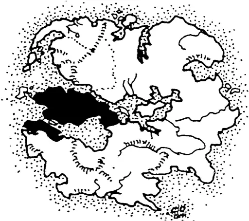
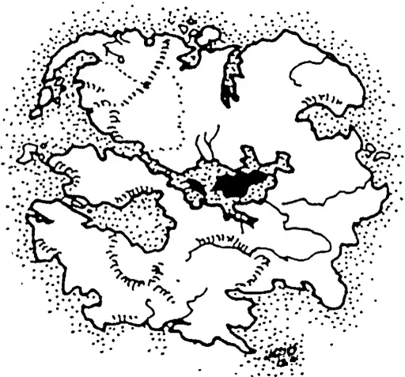
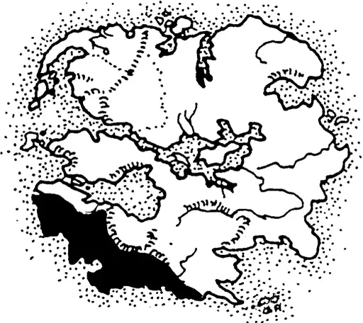

# 12.2钯金世界概览

## 比赞提亚帝国 The Kingdom of Bizantium

这是一个崭新的王国，属于骄傲的航海民族。其居民几乎全是人类，这里是已知世界中最遥远的人类王国。它远比东方领土上的任何城邦和王国都要强大，并且与狼人帝国之间的血腥冲突少之又少（这或许得益于它的偏远位置）。比赞提亚被视为“人类领地”的一员，虽然与东方领土有着频繁的贸易往来，但它依旧保持着独立王国的地位。欲了解更多关于比赞提亚的信息，请参阅《钯界传奇III：海上冒险》（第一版或第二版）。

## 北部大荒原 The Great Northern Wilderness

北部大荒原是一片广阔而人口稀疏的区域，由森林与雪域构成。北部一半覆盖着茂密无尽的针叶林（云杉、冷杉与松树），这些树木一直延伸至东北方的阿尔戈山脉。较低处的森林则转变成一种混合林带，其中包括了坚韧的落叶树（桦树、柳树等）与针叶树，一直延伸到东方领土的北半部（争议之地）。

这片荒野直到最近才成为人类定居的目标，主要集中在南部海岸以及奥菲德草原附近。对于人类以及其他种族而言，大部分荒野仍旧未被探索；即便是将此地视为家园的狼人族也未曾完全踏足或绘制出整个地区的地图——大约有百分之四十的地区依然未知，而剩余的百分之六十也没有详尽的地图记录。

狼人帝国宣称整个北部大荒原以及东方领土的部分北部为其领土。尽管狼人及其同族遍布北方各地，但在阿尔戈山脉一带最为强大，那里坐落着他们的首都，以及沿着阿尔戈海直至东方领土北部的海岸线。

在这最后的避难所里，高耸入云的巨木、葱郁的绿植与蓝天之下，精灵族、翼尖族及侏儒们比比皆是。此外，在北方还能找到熊人、康科兰人、德拉肯人、龙狼、羽死鸟、吸血者、獠牙兽以及其他众多生物（详情可见两版《怪兽与动物》中的描述）。

## 北方山脉 The Northern Mountains

这些雄伟的山脉将诅咒之地与北部大荒原隔绝开来，从东海岸绵延至西海岸，长度超过一千英里（约1600公里）。传说中，众神创造了这些山脉以保护世界免受另一边泛滥的邪恶侵袭。山脉之中居住着多种族裔，其中不乏数个强大且规模庞大的狗头人社群，还有一些最后的洞穴人和侏儒部落。

## 奥菲德草原 Ophids's Grasslands

这是一片辽阔平坦的冻土，大体上无人居住。在东北方向，存在着被称为“恶魔印记”的地方，据信那是一个通往恶魔维度的次元节点。所有族群都对恶魔印记避之不及。这片平原几乎不见生命迹象，除了少数几个游牧的小部落，这些部落由兽人、哥布林和熊怪组成，偶尔也会遇见独自行动或是小团体的人类、熊人、狼人、科伊尔人、康科兰人或埃梅林人。西方帝国正考虑沿草原南部海岸线进行扩张。

## 诅咒之地 The Land of the Damned

对于这片北方的神秘区域，人们知之甚少。其东部边界由巨大的山脉守护，沿海水域则充斥着海蛇，阻挡了探险者与冒险者的脚步。北部的绝望之海尤为危险，那里不仅栖息着各式各样的恐怖生物，还时常遭受可怕的风暴袭击。在整个人类的集体记忆中，没有任何船只曾成功穿越这片海域。根据某些传说，这些海蛇是由统治这片神秘土地的力量所培育出来的。

传说中还提到了一些施展亡灵巫术及其他禁忌魔法的法师，以及一个名为要塞的地方——那是文明与权力的中心。据说，诅咒之地居住着巨人、食人魔、巨魔、龙、恶魔以及各种邪恶生物。

## 西方帝国 The Western Empire

已知最古老的人类王国便是西方帝国。由于大量精灵和矮人难民的涌入（有人说，还包括了一些魔法的禁忌秘密），这个城邦迅速成长为第一个伟大的人类王国。近一千五百年来，西方帝国一直是不可小觑的力量，即便到了今天，它仍然是最大且最令人畏惧的人类王国。西方帝国发起了许多著名的征服战役、十字军东征和远征军行动。近十年来的传闻表明，帝国可能正在准备进入一个新的扩张时代，目标可能是旧王国，以及北方的奥菲德草原——有些人担心，甚至可能包括斐地和洛潘。

西方帝国曾一度辉煌，却很快陷入了衰败。在某个时期，整个帝国似乎濒临崩溃，被专制统治、城邦间的内讧、肆虐的暴行、狂热的宗教邪教、盗窃、谋杀、暗杀、腐败以及普遍的社会/政治衰退撕裂。正是利奥波德一世皇帝率领来自东方的军团，手持闪电武器并在独眼巨人的辅佐下，征服了这些摇摇欲坠的城市。随后几代的皇帝继续清除土地上的邪恶势力，重新统一了城邦并重建了西方帝国。

如今，她的城市塔楼再次在阳光下闪耀，作为世界领先的力量而受到敬畏与尊重。西方帝国已经作为人类文明的宝座存在了六千年，至今仍然在魔法之道上处于领先地位，但同样因其持续不断的堕落、腐败、奴隶制度、血腥运动和残忍而闻名。它那一千座闪耀的城市仍被腐败所困扰，并存在着数十个可怕的邪教。许多城市由强大的盗贼公会、法师或刺客组织统治或控制。奇异的宗教教派和宗派也在这个文明拥挤的人群中繁荣发展。北方的人们和东方领土的人们称其为“罪恶帝国”。

帝国也变得越来越军事化，不断扩充舰队和陆军。年轻的伊托马斯领主大胆地谈论全球征服，并有传言说他像他的先祖们一样与独眼巨人达成了协议。还有传言称，伊托马斯说服了那位只被称为“山峦杀手”的古代隐士巫师加入了他的事业。“山峦杀手”被认为是这个时代最伟大的活生生的巫师（尽管很少有人见过他）。也有传言说，正是他教导了伊托马斯魔法艺术。众所周知，伊托马斯领主可以用眼神杀人（拥有异常大量的I.S.P.的强大心灵感应者——一个变种人）。

## 独眼巨人之岛 The Isle of the Cyclops

这座岛屿居住并由这些独眼巨人统治，是所有巨人和其他许多怪物种族的庇护所。西方帝国是唯一已知定期与独眼巨人进行贸易并缔结同盟的人类王国。

四姐妹群岛也被独眼巨人声称拥有，并且岛上居住着狮鹫、魔法生物以及其他巨人种族及其盟友。

## 东境 The Eastern Territory

东境在地理面积上大于其他任何人类似王国，但由数百个小而独立的城邦、城镇和村庄组成，以及少数较大的新兴王国，它们通过贸易协定和外交条约松散地联合在一起。这里没有一个中央政府或统一的领导，当面对如狼人帝国这样统一的敌人时，这可能是它最大的弱点。此外，所谓的领土主要是未被探索的荒野，最古老和最繁荣的王国与社区位于大河和南海岸沿线。相比之下，西方帝国是世界上人口最稠密的地区之一。

东境的文明区域主要由人类、精灵和矮人主导，不过地精、狗头人、兽人、哥布林、食人魔以及其他种族也在此生活。许多东方的社区都是繁荣的新兴城镇，整个领土也是世界上发展最快的地区之一。新的城邦、城镇、村落和前哨站似乎一夜之间涌现出来。然而，随着人类越过伟大的河流向北推进，他们开始入侵狼人帝国声称拥有的土地。更糟糕的是，自最早的接触以来（西方帝国的奴隶贩子），狼人和人类之间就有着一段充满误解、仇恨和战争的血腥历史。

这片土地本身是连绵起伏的丘陵、草原以及针叶与阔叶混交林的结合体。北部主要是密集的针叶与阔叶混交林，偶尔点缀着轻林和谷地。这一区域大部分尚未被探索，也鲜有人居住。南部则是较轻的混交林，其间散布着草地、牧场、农田和新村落。这是目前人类及其盟友正在定居的地区，尤其是沿海地带人口最多。东方领土或许是现存最大的海上力量，仅与西方帝国和拜占庭相匹敌。其海港星罗棋布于海岸线上，一些最大和最强有力的东方城市矗立在海边。

## 斐地 洛潘 Phi Lopan

这两个都是海岛王国，也是在东境上建立的一系列新兴国家的一部分。两者都非常发达，拥有数十座大城市、海港和舰队，并且相当自给自足。有关西方帝国扩充其舰队和军队的传闻令一些居民感到不安。他们富饶的土地将是帝国的一个不错补充。洛潘尤其受到西方贵族和富裕阶层的喜爱，是他们度假的首选之地。

## 旧王国山脉 Old Kingdom Mountains

这些古老的山脉保存着伟大狗头人王国最后的遗迹。狗头人族在精灵与矮人的战争中遭受了极大的损失，并在人类的时代逐渐失去了他们的地位。尽管如此，旧王国山脉依然是狗头人族的坚固堡垒，估计有六百万狗头人栖息于此，另有数百万散布在世界各地。

这些山脉曾经完全被矮人所主宰，他们那壮丽的地底王国遍布整座山脉。矮人王国在规模、力量和荣耀方面仅次于精灵王国，而在他们之后则是狗头人王国。正是在这山脉深处的空旷腹地中，矮人们锻造出了传说中的符文剑。然而，矮人与精灵之间的史诗般战斗最终摧毁了整个矮人文明。

如今，一些古老的矮人隧道已被矮人、狗头人、洞穴人或哥布林重新占据，但大多数（约70%）已经坍塌或成为了破败的废墟，居住着过往的幽灵。

## 旧王国 The Old Kingdom

尽管有古老的遗迹、壁画和无数关于精灵与矮人时代的传说，但对于那些被矮人称为“年轻种族”的人类、狼人、科伊尔人以及其他种族来说，他们难以真正想象近一万五千年前这些古老文化的实际面貌。如今，旧王国不过是一片荒凉的废土，主要居住着所谓的怪物种族。只有偶尔可见的精灵要塞高耸于灌木平原和稀疏的森林之上。那些金色的塔楼和宏伟的城墙作为往昔时代的见证，令人印象深刻。这些是世界上最古老的地表城市之一，也是大陆上少数几个可以找到数千精灵聚居的地方。然而，尽管这些最后的有围墙的精灵城市令人印象深刻，它们却是老旧、肮脏且拥挤的——这些摇摇欲坠的遗迹尚未完全消逝。

这片灌木平原、稀疏的森林和干涸的土地，曾经是繁茂的森林、青草平原和点缀着数百个精灵村落和城镇的农田。商队路线如同巨蛛网一般纵横交错，每天都有数百名旅行者行走在这条磨损的路上。从山丘上崛起的是精灵的城市和堡垒，那里曾经居住着地球上最强大的国王、巫师和战士。据说，精灵的城市，以其众多的塔楼、巨大的石质金字塔和高达二十层的建筑，看起来就像是降落在大地上的巨大天冠。

精灵的城市以其高等学府、魔法和科学而闻名。据信，这里曾经居住着大约一亿精灵，是大陆上一个富饶的中心。最后一批著名的泰坦也在这光辉的城市中找到了避难之所，与其他友好种族如初生的人类，以及顺从的哥布林、霍布哥布林和兽人部落一同生活，后者构成了精灵劳动力的核心。

在山脉、丘陵、一些低地乃至一些精灵城市的地下，隐藏着看似无害的矮人帝国。除了少数地表城市和贸易站外，一般的地表居民对脚下隐藏的奇迹毫无所知。庞大的地下隧道网络、矿井、村落和城市像一系列巨大的蜂巢一样贯穿大地和山脉。一座矮人城市往往像是黑暗地下隧道或洞穴尽头的一颗璀璨宝石。宏伟的竞技场、大教堂乃至整个城市都是从基岩中雕刻而成。这些城市的墙壁上装饰着雕刻、艺术品和宝石。矮人天生擅长处理石材，因此墙壁和拱门常常饰以复杂的雕刻、浮雕、滴水嘴和雕像。小巧如手掌大小的玩具雕像雕刻得栩栩如生，而从人类大小到百尺（约30.5米）高的巨型雕像则排列在走廊两侧或矗立于地下庭院或穹顶会议厅的中央。矮人的雕像涵盖了所有可以想象的主题，从他们自己的文化和宗教（诸神和矮人英雄）到地表居民、动物、昆虫、鱼类、鸟类、怪物等等！使用的材料可以从简单的皂石、石英或基岩到大理石、雪花石膏、乌木、玉、水晶、银和金。许多雕像还会用宝石（钻石、蓝宝石、绿宝石等）或贵金属进行额外装饰，但无论是简单的石雕还是镶嵌着宝石或贵金属的华丽作品，工艺总是无可挑剔，成品都是精致的艺术品。直到今天，矮人的雕像（无论新旧）、切割宝石和珠宝都是世界上最令人垂涎的珍品。在那些强大的矮人容忍其存在的地方，或者在矮人尚未占领的地区，则居住着狗头人、侏儒以及偶尔出现的洞穴人或哥布林部落。

两大帝国曾繁荣昌盛，其辉煌与智慧达到了前所未有的高度，然而这一切都在长达两千年的精灵与矮人之战中轰然倒塌。当这场传说中的战争结束之时，仅存不到十二座精灵城市，其中许多还饱受战火摧残。曾经拥有亿万人口的精灵族，战后幸存者不足千万。昔日葱郁的森林、肥沃的农田和平原皆化为乌有。即便六千年已逝，许多地方仍旧是焦土一片，稀疏的林木见证着那段历史。尽管如此，矮人的损失更为惨重，超过两亿三千万的生命消逝。

悲剧中最易被遗忘的部分（或是人们选择不去谈论的部分）是其他种族所遭受的巨大损失。泰坦，在与古神的战争中已元气大伤，又失去了他们族群的百分之二十。与精灵并肩作战的山居拉胡人，则有百分之六十的种族被毁灭。数以百万计的兽人、哥布林、半兽人以及小鬼在双方的战斗中丧生；其中一半是被迫服役的劳工和战士奴隶，他们别无选择只能为嗜血的主人而战。无辜卷入战火的还有侏儒与穴居人；侏儒种族损失了百分之九十，而穴居人也失去了他们中的百分之七十五。半兽人的数量同样减少了百分之九十，尽管他们在战争中的角色并不清白。

为何旧王国（当时的新王国）会居住着大量的地下居民至今仍是一个谜团。某些矮人的传说指出，旧王国或许是许多现代种族的起源之地，也是在与古神那场旷世大战之后，少数幸存下来的古老种族（如精灵、泰坦、变形者及龙）最终落脚之处。同样的传说还暗示，将旧王国与提米罗隔开的东方山脉正是Xy的脊梁——那是在传说中最强大且邪恶的怪物之一。许多人坚持认为，《崔斯坦编年史》似乎支持这一理论，因为书中常被引用的一段文字这样写道：

“……当魔法与混沌的漩涡终于平息，令人畏惧的古神们陷入了大地深处的魔咒沉睡之中，世界由此重生。海洋退却，古老的河流干涸成尘，然而生命之水无法被束缚，很快找到了新的流向。山脉沉降成为山谷，而在未曾有过的地方，新的高峰崛起，仿佛是为了标记那些沉睡怪兽的安息之所。于是，伟大的古神孕育了指向南方的新王国山脉，正如炽热之山与绯红水域之前及其他标志混沌领主消逝之地的形成。”

Xy，古神之主宰，常被简称为“伟大的古神”。众多学者坚称，《崔斯坦编年史》中的这段记载证明Xy正在旧王国东南部的山脉之下或之中沉睡。另一些学者则认为，该段落只是泛泛而谈，并未明确指出这些山脉就是Xy的安息之地。事实上，很可能正是这段文字激发了矮人关于山脉实为Xy脊梁的传说。这些山脉本身并无特别之处，无论是人类还是矮人的探险队伍都未能找到任何证据表明“伟大的古神”就躺在它们之下。当然，这些山脉的地下深度只有不到百分之一被探索过。

大多数学者认同，“燃烧之山”指的是尼姆罗山，这座火山自从有记录的历史以来一直活跃，大约在三万至六万年前它可能更靠近内陆海。尼姆罗山的形成远在其后。

旧王国是一片温暖湿润的土地，拥有广阔的平原、沙漠、沼泽地，南部则是亚热带森林；北部和东部则遍布丘陵、肥沃的低地以及零星分布的森林。

讽刺的是，如今只剩下寥寥几座精灵城市位于东北方接近东境的地方，他们曾经辉煌的王国大部分地区如今已是怪物们的领地。人类虽然在北部海岸和东境附近建立了几个前哨站，但面对这些敌对的怪物种族，目前仍感到难以应对。

## 尼姆罗山Mount Nimro

尼姆罗山及其周围约150英里（240公里）的区域被称为巨人之地，因为这里是世界上各种巨人的最大聚集地。尼姆罗山与尼姆罗德山均为活火山，由六个强大的尼姆罗火巨人部落占据主导地位。该地区的其他巨人还包括吉甘特巨人、乔坦巨人、巨魔，以及数个食人妖部落，偶尔还能见到独眼巨人。此外，兽人和哥布林也在这一带颇为常见。西方帝国担忧，这些不断壮大的巨人集体可能正在秘密组建自己的王国，未来或许会对帝国构成威胁。

此地地形险峻，气候炎热而潮湿，岩石遍布。南部覆盖着稀疏的丛林，两座火山及西部群山周围则是高草草原与灌木丛。

## 巴尔戈荒原The Baalgor Wastelands

这是一片广阔无垠的低洼岩地，干裂的土壤与沙漠构成了它的主体。偶尔可见零星的草地或灌木丛散落其间，但总体而言，这里是一片荒凉之地——很难想象，这片令人生畏的土地曾经是繁茂的森林，以及最伟大的古代精灵城市的家园。如今，巴尔戈荒原上居住着游牧的兽人部落，以及零星出现的哥布林、半兽人、小鬼、食人妖、卢加鲁、安德罗斯、西洛纳尔、太阳恶魔和人类。更多的哥布林、食人妖和小鬼，以及巨魔，栖息于围绕着荒原盆地的低地和山脉之中。根据一些当地的神话传说，光明与黑暗之神曾卷入了一场冲突，从而造就了这片荒原。

这片土地不仅承载着往昔的辉煌记忆，同时也笼罩在一层神秘的面纱之下，仿佛每一粒沙砾、每一块岩石都诉说着古老的故事。在这片荒凉之地中，光明与黑暗交织，留下了永恒的印记。

## 提米罗王国The Timiro Kingdom

这是人类最古老的王国之一，汇聚了来自世界各地的商人与奇珍异宝。它依然是独立的人类王国中最富裕且最具影响力的国度。然而，提米罗王国最大的忧患来自于那些四处游荡的食人妖和兽人部落，它们不断地蹂躏边境城镇，干扰着旧王国、西方帝国与东境之间的陆上贸易。食人妖居住在与提米罗王国接壤的山脉中，这为它们提供了天然的防御屏障。欲了解更多关于提米罗王国的信息，请参阅《钯界传奇游戏书：古神》（第二版将于1996年夏季发行）。

## 南风之土Land of the South Winds

南风之土是一片广阔而平坦的土地，这里干旱的短草平原与众多沼泽湿地并存。南部海岸线是殷-斯洛特丛林的尾端，未曾有人探索。这片不宜居的环境是此领地从未得到完全开发的原因之一，尽管它是最古老的人类居住地之一。

南风之地主要居住着人类与狗头人。它拥有相当强大的海上力量，主要与提米罗王国及西方帝国进行贸易往来，同时也被怀疑从事海盗活动。与其他人类王国相比，它是其中最为贫穷的一个，并且地理上也相对隔绝。

## 殷-斯洛特丛林The Yin-Sloth Jungles

殷-斯洛特丛林覆盖了大半个南半球，几乎完全未经探索。这是一个古老宗教与远古神祇共存之地，充斥着各种怪异生物。这片原始土地沉浸在神秘与迷信之中，为北方的人类及其他种族所避讳。更多关于这一区域的信息，请参阅《钯界传奇游戏书VII：殷-斯洛特丛林》。

弗洛恩里群岛位于丛林东南方，由野蛮的人类与非人类种族所居住的一串岛屿组成。关于这些岛屿笼罩着一层神秘面纱，有传言说最后的精灵领主们在此寻求庇护。一些人相信，在其中一个岛上仍然存在着一个战士精灵的文明。

